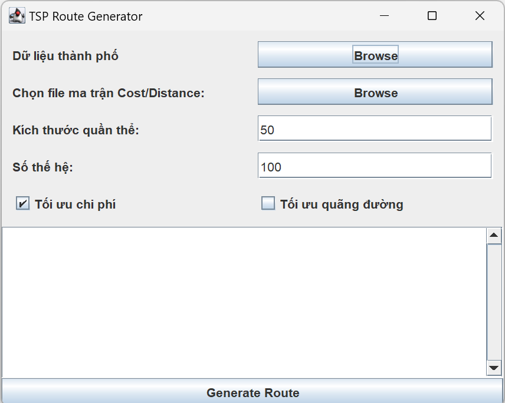
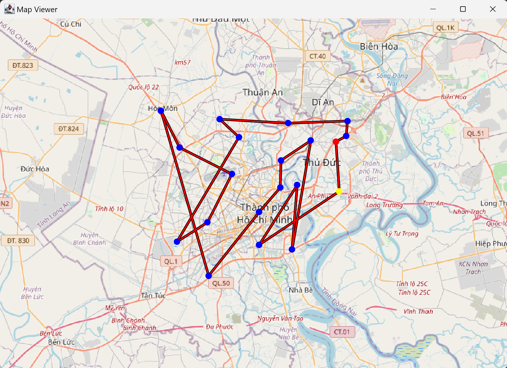

# Artificial Intelligent Project (Đồ án trí tuệ nhân tạo)
Đề tài: **Nghiên cứu về thuật giải di truyền và ứng dụng trong bài toán người bán hàng** 

TSP Route Generator là một ứng dụng sử dụng thuật toán di truyền (Genetic Algorithm - GA) để giải quyết bài toán Người du lịch (Traveling Salesman Problem - TSP). Ứng dụng cho phép người dùng tối ưu hóa chi phí hoặc quãng đường di chuyển giữa các thành phố dựa trên dữ liệu đầu vào.

## Hình ảnh



## Tính năng chính
- Tối ưu hóa lộ trình dựa trên chi phí hoặc khoảng cách giữa các thành phố.
- Hỗ trợ giao diện đồ họa giúp người dùng dễ dàng tương tác.
- Hiển thị lộ trình tối ưu trên bản đồ.
- Cho phép tùy chỉnh kích thước quần thể, số thế hệ, và lựa chọn phương pháp tối ưu.

## Yêu cầu hệ thống
- **JDK**: Phiên bản 8 trở lên.
- **Môi trường phát triển**: IDE như IntelliJ IDEA, Eclipse hoặc các IDE khác hỗ trợ Java.
- **SDK**: SDK 21 hoặc cao hơn.

## Maven dependency  
`pom.xml`:
```xml
<dependency>
    <groupId>org.jxmapviewer</groupId>
    <artifactId>jxmapviewer2</artifactId>
    <version>2.8</version>
</dependency>
```
